# 🛠️ Workplace Accidents & Injuries Analysis  


[](https://www.linkedin.com/in/mohamed-emad-396981344)
[](mailto:mohamedemad24649@gmail.com)

---

## 📖 Project Overview  
This project analyzes **workplace accidents and injuries** to uncover key patterns, risk factors, and safety issues.  
The ultimate goal is to support **data-driven decisions** in occupational safety and prevent future incidents.  

The analysis process included:  
1. **SQL Server** – Advanced queries to explore and clean the dataset.  
2. **Python (Pandas, Seaborn, Matplotlib)** – Visual analysis and statistical insights.  
3. **Power BI (in progress)** – An interactive dashboard for exploration.  

---

## 📂 Repository Structure  
```
workplace-accidents-analysis/
├── data/ # Input dataset (CSV/Excel)
├── sql_queries/ # SQL Server queries
│ └── queries.sql
├── python/ # Python notebooks & scripts
│ └── analysis.ipynb
├── charts/ # Auto-saved visualizations from Python
│ ├── malfunction.png
│ ├── top_event_descriptions.png
│ ├── monthly_distribution.png
│ ├── haz_substances.png
│ ├── building_stories.png
│ ├── project_type.png
│ ├── task_assigned.png
│ ├── human_factors.png
│ ├── environmental_factors.png
│ ├── event_types.png
│ ├── body_parts.png
│ ├── injury_types.png
│ ├── fatal_vs_nonfatal.png
├── powerbi/ # in progress
└── README.md # Project documentation
```
---

## 🎯 Purpose of Analysis  
- Identify the **most frequent accident types and causes**.  
- Highlight **risk-prone tasks, projects, and body parts**.  
- Understand **human and environmental factors** behind accidents.  
- Provide **recommendations** for improving workplace safety.  

---

## 📊 Key Findings  

### 1️⃣ Incidents Related to Malfunction  
  
- Operations (~105), Production (~110), and Equipment (~40) dominate malfunction-related incidents.  

---

### 2️⃣ Top 10 Event Descriptions  
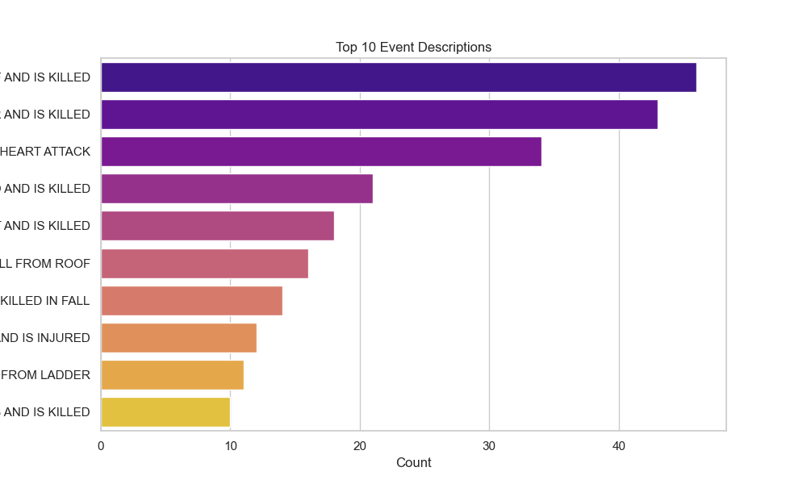  
- Fatal events dominate descriptions → **falls and health conditions are leading causes**.  

---

### 3️⃣ Monthly Distribution of Incidents  
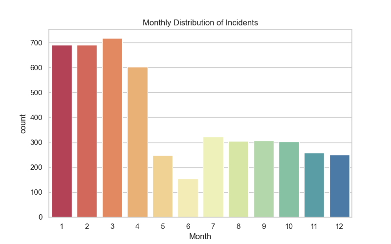  
- Peaks in **Jan–Mar (~680–720)**, sharp decline in summer months.  

---

### 4️⃣ Incidents Involving Hazardous Substances  
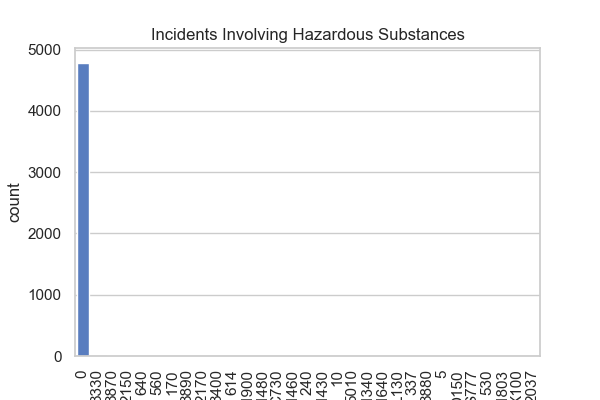  
- Over **4,800 incidents had no hazardous substances involved**.  

---

### 5️⃣ Incidents by Building Stories  
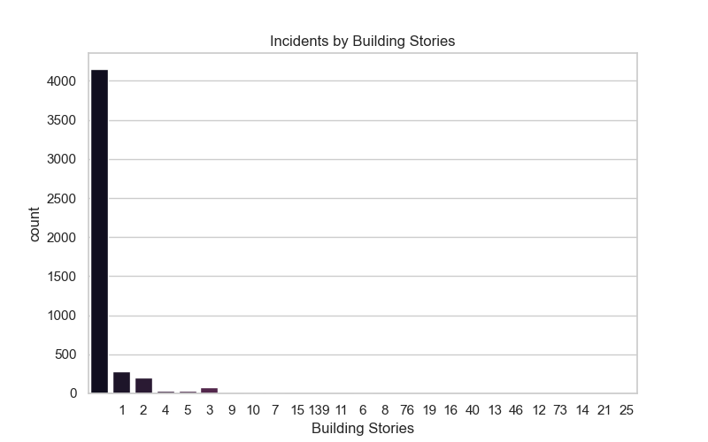  
- Majority in **1–2 story projects (~740 combined)**.  

---

### 6️⃣ Incidents by Project Type  
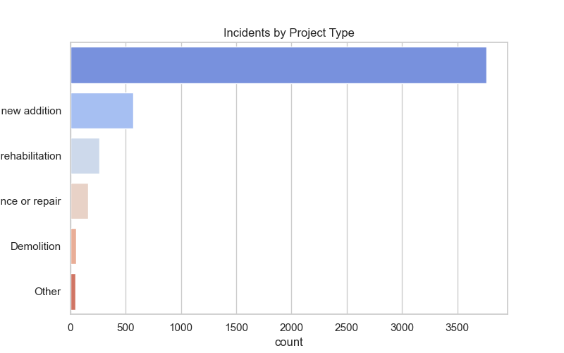  
- **New additions (~3600)** dominate incidents.  

---

### 7️⃣ Incidents by Task Assignment  
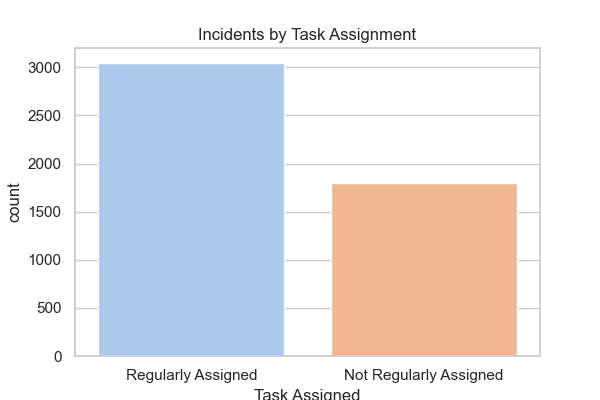  
- **Routine tasks (~3000)** carry higher risks than non-routine (~1800).  

---

### 8️⃣ Human Factors in Incidents  
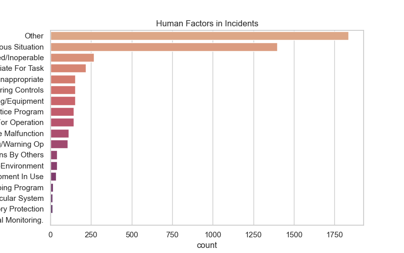  
- Major causes: **Other, Situational Awareness, Inappropriate Action**.  

---

### 9️⃣ Environmental Factors  
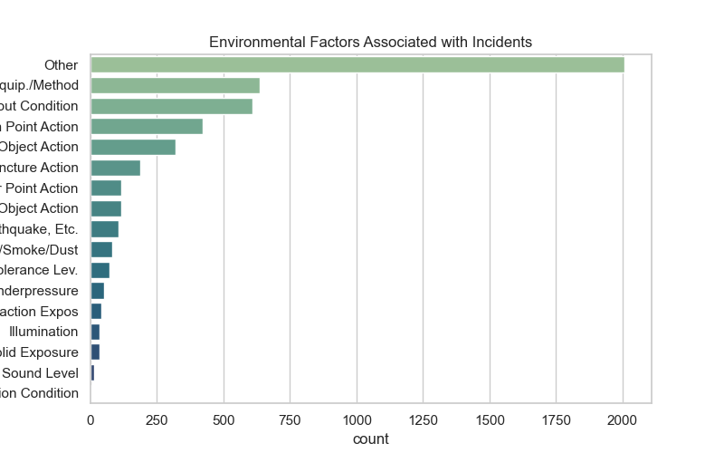  
- Leading: **Other, Equipment/Method, Condition factors**.  

---

### 🔟 Event Types Leading to Injuries  
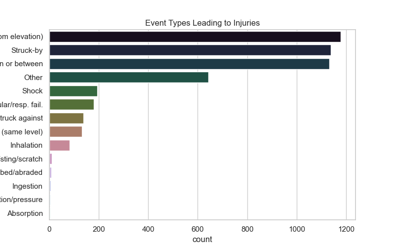  
- **Falls from elevation** and **Struck-by incidents** are top risks.  

---

### 1️⃣1️⃣ Most Frequently Injured Body Parts  
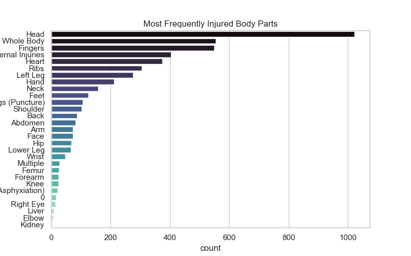  
- Most affected: **Head, Whole Body, Fingers**.  

---

### 1️⃣2️⃣ Most Common Injury Types  
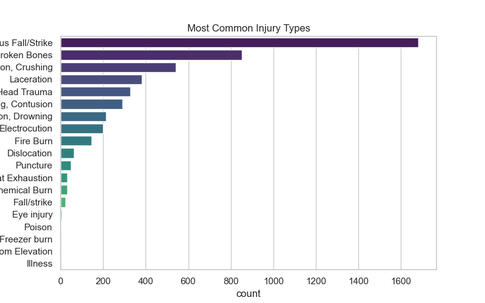  
- Top: **Falls/Strikes (~1700)**, Broken Bones (~600), Concussions/Crushing (~700).  

---

### 1️⃣3️⃣ Fatal vs Nonfatal Injuries  
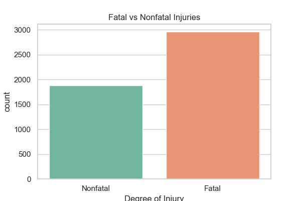  
- **Fatal injuries (~2900)** exceed nonfatal (~1900).  

---

## ✅ Recommendations  
1. **Strengthen fall-prevention measures** in roofing and elevated work.  
2. **Improve training and situational awareness** to reduce human factor risks.  
3. **Enhance safety in routine tasks**, not just special/irregular jobs.  
4. **Focus on malfunction prevention** through equipment checks and safety protocols.  
5. **Seasonal safety campaigns** (especially in Jan–March).  

---

## 📌 Next Steps  
- Develop a **free interactive Power BI dashboard** (currently in progress).  
- Add **predictive modeling** to identify high-risk conditions early.  

---

## 👤 Author  
**Mohamed Emad Elhadi** – Data Analyst  **
